:tangerine: **Author: Chenzi Zhang**  

Course notes for Udacity ['How to Use Git and GitHub'](https://classroom.udacity.com/courses/ud775).   

This course provides an introduction to Git version control logic and practice and further gives instruction to project collaboration on GitHub.

My Work Space  
iCloud on MacBook Pro: `cd ~/Library/Mobile\ Documents/com~apple~CloudDocs/`  
Text Editor: `cd /Applications/Sublime\ Text.app`   

Links  
[Git Cheat Sheet](https://github.com/github/training-kit/blob/master/downloads/github-git-cheat-sheet.pdf)  
[Commit Style Guide](http://udacity.github.io/git-styleguide/)

Table of Contents  
- [Lesson 1: Version Control](#lesson-1--version-control)
  * [Basic Command For Commit History Navigation](#basic-command-for-commit-history-navigation)
  * [Git Workspace Setup](#git-workspace-setup)
  * [Summary](#summary)
- [Lesson 2: Read and Write Git](#lesson-2--read-and-write-git)
  * [Repository, Staging Area and Commit](#repository--staging-area-and-commit)
    + [Logics](#logics)
    + [Repository: Create by `git init`](#repository--create-by--git-init-)
    + [Staging Area: An Intermediate Step by `git add` and `git reset`](#staging-area--an-intermediate-step-by--git-add--and--git-reset-)
    + [Commit: Elegant Commit Message by `git commit`](#commit--elegant-commit-message-by--git-commit-)
    + [Revised: See by `git diff`](#revised--see-by--git-diff-)
    + [Code](#code)
  * [Branches](#branches)
    + [Logics](#logics-1)
    + [Make a Branch: `git branch`](#make-a-branch---git-branch-)
    + [View Branch Graph: `git log --graph`](#view-branch-graph---git-log---graph-)
    + [Reachability](#reachability)
    + [Detached HEAD Revisited: `git checkout`](#detached-head-revisited---git-checkout-)
  * [Combining Files](#combining-files)
    + [Merging a Change into Master: Auto-Merging `git merge`](#merging-a-change-into-master--auto-merging--git-merge-)
    + [Merging Conflicts](#merging-conflicts)
- [Lesson 3: Share and Collaboration on GitHub](#lesson-3--share-and-collaboration-on-github)
  * [GitHub vs Local](#github-vs-local)
    + [Syncing Repositories: `git remote`, `git push`](#syncing-repositories---git-remote----git-push-)
    + [Change a Remote Directly](#change-a-remote-directly)
    + [Pulling Changes: `git pull origin master`](#pulling-changes---git-pull-origin-master-)
  * [Collaboration on GitHub](#collaboration-on-github)
    + [Forking a Repository: Make a Copy](#forking-a-repository--make-a-copy---top---git-and-github-notes--)
    + [Conflict](#conflict----top---git-and-github-notes--)
    + [Updating Local Copies of Remote Branches: `git fetch`,`git pull`](#updating-local-copies-of-remote-branches---git-fetch---git-pull---top---git-and-github-notes--)
      - [Merging the Changes Together](#merging-the-changes-together)
      - [Fast-Forward Merges](#fast-forward-merges)
    + [Pull Request](#pull-request----top---git-and-github-notes--)
      - [Making a Pull Request](#making-a-pull-request)
      - [Updating a Pull Request](#updating-a-pull-request)
      - [Conflicting Changes](#conflicting-changes)
      - [Updating Your Local Repository](#updating-your-local-repository)
    + [Fork](#fork----top---git-and-github-notes--)
      - [Modifying the Adventure Repository](#modifying-the-adventure-repository)
      - [Keeping a Fork Up-to-Date](#keeping-a-fork-up-to-date)
- [Reference](#reference)


# Lesson 1: Version Control
## Basic Command For Commit History Navigation
Concepts  

| git | repository | commit |
|---|---|---|
|  | `clone`| `log` |
|  |        | `diff`|

Check difference between versions

| Category | Command |
|---|---|
| Local | `diff -u old.js new.js`|
| Repository |  `git diff -u old.js new.js`|

Git command on local repository  
* `git --version` : Take a look at the version of your git
* `git log --stat`: Check the current commit status where `+` is add and `-` is delete
* `git diff -u commitID_old commitID_new`: Check difference between two versions

Git command on a cloned repository  
* `git clone [repository URL]`: For example https://github.com/udacity/asteroids.git
* `cd asteroids/`
* `git diff commitID_old commitID_new`
* `git config --global color.ui auto`: Colorize git output. `--global` means applying to all files , not only this one  
* `git checkout commitID_old`: Because we want to know which file in the repository has the bug


``` shell
(base) Chenzis-MBP:asteroids chenzizhang$ git checkout b0678b161fcf74467ed3a63110557e3d6229cfa6
Note: switching to 'b0678b161fcf74467ed3a63110557e3d6229cfa6'.

You are in 'detached HEAD' state. You can look around, make experimental
changes and commit them, and you can discard any commits you make in this
state without impacting any branches by switching back to a branch.

If you want to create a new branch to retain commits you create, you may
do so (now or later) by using -c with the switch command. Example:

  git switch -c <new-branch-name>

Or undo this operation with:

  git switch -

Turn off this advice by setting config variable advice.detachedHead to false

HEAD is now at b0678b1 Revert controls
```

Git errors and warnings solution  
* Warning: `Should not be doing an octopus`  
Octopus is a strategy Git uses to combine many different versions of code together. This message can appear if you try to use this strategy in an inappropriate situation.  
* Warning: `You are in 'detached HEAD' state`  
HEAD is what Git calls the commit you are currently on. You can “detach” the HEAD by switching to a previous commit. Despite what it sounds like, it’s actually not a bad thing to detach the HEAD. Git just warns you so that you’ll realize you’re doing it.
* Error: `Panic! (the 'impossible' happened)`  
This is a real error message, but it’s not output by Git. Instead it’s output by GHC, the compiler for a programming language called Haskell. It’s reserved for particularly surprising errors!  

Additional Shell and Git command  
* `vim game.js`: open the JavaScript which is editable  
* `*`: This means that the doc was changed. If we undo the change, the `*` will disappear  
* Quick fill for git command: For example, type `git l`. Then hit `Tab`, it will automatically fill this line with `git log`.  


## Git Workspace Setup  
STEP 1(Optional): Changing background color  
`Colors` --> `Defaults`  

STEP 2: Downloading necessary files
* Save this [file](https://raw.githubusercontent.com/git/git/master/contrib/completion/git-completion.bash) in home directory with the name `git-completion.bash`.
* Save this [file](https://raw.githubusercontent.com/git/git/master/contrib/completion/git-prompt.sh) in home directory with the name `git-prompt.sh`.
* Download `bash_profile_course` [file](https://www.udacity.com/api/nodes/3341718587/supplemental_media/bash-profile-course/download?_ga=1.37232743.672083044.1467344711).
* If you already have a file in your home directory named `.bash_profile`, copy the content from `bash_profile_course` and paste it at the bottom of `.bash_profile`. Otherwise, move `bash_profile_course` to home directory and rename it to `.bash_profile`. (Learn more about how bash prompts work, see this [page](http://www.cyberciti.biz/tips/howto-linux-unix-bash-shell-setup-prompt.html).)

STEP 3: Git configurations  
* Editor setup:   
Add the following line to your `.bash_profile` (you may need to change the path if Sublime is installed in a different location for you)
```Shell
`alias subl="/Applications/Sublime\ Text.app/Contents/SharedSupport/bin/subl"`
```
* Making Git configurations:  
```Shell
git config --global core.editor "'/Applications/Sublime Text.app/Contents/SharedSupport/bin/subl' -n -w"
git config --global push.default upstream
git config --global merge.conflictstyle diff3
```

STEP 4: Restart the terminal  

## Summary  
Tracking Versions:
* Accessibility of old versions  
 You could still access the old version of the file by checking out the commit associated with that version. Then the recipe would temporarily revert to its state at the time that commit was made.  
* Command for version comparison  
Using `git diff` to compare the two versions would show the same changes as `diff -u` did in the previous exercise. Even if the exact format was slightly different, the actual changes indicated would be the same.
* File name for new versions  
Git does not rename files when you save a new commit. Instead, Git uses the **commit IDs** to refer to different versions of the files, and you can use `git checkout` to access old versions of your files.  
* Git's way of saving versions  
To save two versions of the file, you would create two commits.  

Git Command Review:  

| Command | Args | Details |
|---|---|---|
| `git diff` | Two commit ids | Print each line that is present in one commit but not the other |
| `git clone` | URL of the repository | History is copied (but not for copying a directory) |
| `git checkout` | Commit ID  | 	Temporarily reset all files in a directory to their state at the time of a specific commit |
| `git log` | None | Show the commits made in this repository, starting with the most recent|

Next Steps:
* How to use my own machine to create a new repository and make commits
* What it means to merge and branch in Git
* How to use these tools to keep track of experimental changes to my projects


# Lesson 2: Read and Write Git  

## Repository, Staging Area and Commit
[[top](#Git-and-GitHub-Notes)]   

### Logics

Repository  --> Staging Area  --> Elegant Commit Message  --> Revise  

From working directory to repository

| Working Directory | Staging Area | Repository |
|---|---|---|
| cake.txt | cake.txt | cake (commit)|
| frosting.txt | frosting.txt | frosting (commit)|
| chili.txt | | |
| <span style="color:gray">.git</span> | <span style="color:gray">.git</span> | <span style="color:gray">.git</span> |

Note: <span style="color:gray">.git</span> is a hidden file which contains config and objects.  `ls -a` shows hidden files.  

### Repository: Create by `git init`

Initializing a repository: `git init`    
* In an empty directory and create files later
* In a directory which already contain files  

After init, check this repository:
* `ls -a`: A `.git` is created
* `git log`: Times of commit is 0
* `git status`: Check status

### Staging Area: An Intermediate Step by `git add` and `git reset`

* `git add [file name]`: `git add cake.txt`. Add a file to an intermediate stage before commit.  
* `git reset [file name]`: `git reset cake.txt`. Remove a file from the staging area.  
* `git reset --hard`: Cancel all changes in staging area.  

### Commit: Elegant Commit Message by `git commit`  
Before commit:  
* Set up an editor for long commit messages  
* Commit is a snapshot of a Git repository  

Commit:  
* `git commit` or `git commit -m "Commit Message"`: Instead of just `git commit`, you can specify a commit message via the command line  
* Check status after committing  

Commit message [style guide](http://udacity.github.io/git-styleguide/):  
```
type: subject
body
footer
```

### Revised: See by `git diff`  
Comparing working directory, staging area, and repository:  
* `git diff` only: Working Directory vs Staging Area
* `git diff --staged`: Staging Area vs Repository  
* `git diff [commit_ID1] [commit_ID2]`: Within Repository  
* `git reset --hard`: Cancel all changes in staging area  


* `git checkout master` before commit: When you checked out an old commit, run this command to fix `detached HEAD` state.  

### Code

``` shell
chenzizhang ~ $ cd ~/Library/Mobile\ Documents/com~apple~CloudDocs/DS_Track/Udacity/Git-GitHub/
chenzizhang Git-GitHub $ ls
LICENSE game_new.js game_old.js reflections version-control
chenzizhang Git-GitHub $ cd reflections
chenzizhang (master +) reflections $ git init
Reinitialized existing Git repository in /Users/chenzizhang/Library/Mobile Documents/com~apple~CloudDocs/DS_Track/Udacity/Git-GitHub/reflections/.git/
chenzizhang (master +) reflections $ git status
On branch master

No commits yet

Changes to be committed:
  (use "git rm --cached <file>..." to unstage)
new file:   lesson_1_reflection_prompts.txt

Untracked files:
  (use "git add <file>..." to include in what will be committed)
lesson-2-reflection-prompts.txt

chenzizhang (master +) reflections $ ls -a
. .. .git lesson-2-reflection-prompts.txt lesson_1_reflection_prompts.txt
chenzizhang (master +) reflections $ git log
fatal: your current branch 'master' does not have any commits yet
chenzizhang (master +) reflections $ git add lesson_1_reflection_prompts.txt
chenzizhang (master +) reflections $ git status
On branch master

No commits yet

Changes to be committed:
  (use "git rm --cached <file>..." to unstage)
new file:   lesson_1_reflection_prompts.txt

Untracked files:
  (use "git add <file>..." to include in what will be committed)
lesson-2-reflection-prompts.txt

chenzizhang (master +) reflections $ git commit
[master (root-commit) 2d7d279] Update Lesson 1 Reflection
 1 file changed, 33 insertions(+)
 create mode 100644 lesson_1_reflection_prompts.txt
chenzizhang (master) reflections $ git status
On branch master
Untracked files:
  (use "git add <file>..." to include in what will be committed)
lesson-2-reflection-prompts.txt

nothing added to commit but untracked files present (use "git add" to track)
chenzizhang (master) reflections $ git checkout master
Already on 'master'

```


## Branches  
[[top](#Git-and-GitHub-Notes)]

### Logics  
* Branches are commit labels
* Main Branch: `master` is the real official version
* `detached HEAD`: Warns me that I am looking at a branch which is not labeled with a branch name  
* Draw diagram to understand branches  

[](https://mermaid-js.github.io/mermaid-live-editor/#/edit/eyJjb2RlIjoiZ3JhcGggVERcblx0QVtGaXggYnVnIDFdIC0tPiBCW1VwZGF0ZSBkb2NzXVxuXHRCIC0tPiBDW05ldyBGZWF0dXJlc11cblx0QyAtLT58ZXhwfCBEW0V4cGVyaW1lbnRhbCBmZWF0dXJlXVxuXHRDIC0tPiBFW0ZpeCBidWcgMl1cblx0QyAtLT58aXRhbGlhbnwgRltJdGFsaWFuIHZlcnNpb25dXG4gIEUgLS0-fGJhY2t1cHwgR1tGaXggYnVnIDNdXG4gIEcgLS0-fCptYXN0ZXJ8IEhbRmluYWwgdmVyc2lvbl1cblx0XHRcdFx0XHQiLCJtZXJtYWlkIjp7InRoZW1lIjoiZGVmYXVsdCJ9LCJ1cGRhdGVFZGl0b3IiOmZhbHNlfQ)

### Make a Branch: `git branch`
* `cd [repository name]`
* `git branch`: Check current branches and your location  
* `git branch [new branch]`: Make a new branch
* `git checkout [new branch]`: Switch to the new branch

Example Code  

```shell
chenzizhang version-control $ cd asteroids
chenzizhang ((25ede83...)) asteroids $ git branch
* (HEAD detached at 25ede83)
  master
chenzizhang ((25ede83...)) asteroids $ git branch easy-mode
chenzizhang ((25ede83...)) asteroids $ git branch
* (HEAD detached at 25ede83)
  easy-mode
  master
chenzizhang ((25ede83...)) asteroids $ git checkout easy-mode
Switched to branch 'easy-mode'
chenzizhang (easy-mode) asteroids $ git branch
* easy-mode
  master
chenzizhang (easy-mode) asteroids $ git diff
diff --git a/game.js b/game.js
index 5daadb0..006791e 100644
--- a/game.js
+++ b/game.js
@@ -659,7 +659,7 @@ Asteroid = function () {
     this.scale /= 3;
     if (this.scale > 0.5) {
       // break into fragments
-      for (var i = 0; i < 3; i++) {
+      for (var i = 0; i < 2; i++) {
         var roid = $.extend(true, {}, this);
         roid.vel.x = Math.random() * 6 - 3;
         roid.vel.y = Math.random() * 6 - 3;
chenzizhang (easy-mode *) asteroids $ git add game.js
chenzizhang (easy-mode +) asteroids $ git commit
[easy-mode 5a1a80c] Make asteroids split into 2 smaller pieces instead of 3
 1 file changed, 1 insertion(+), 1 deletion(-)
chenzizhang (easy-mode) asteroids $ git status
On branch easy-mode
nothing to commit, working tree clean
```

### View Branch Graph: `git log --graph`

[](https://mermaid-js.github.io/mermaid-live-editor/#/edit/eyJjb2RlIjoiZ3JhcGggVERcblx0QVtyZXZlcnQgY29udHJvbHNdIC0tPiBCW2ZpcnN0IGNvaW5zXVxuXHRCIC0tPiBDW3NlY29uZCBjb2luc11cblx0QyAtLT4gfGNvaW5zfERbbGFzdCBjb25pc11cblx0QSAtLT4gRVtmaXJzdCBjaGFuZ2VdXG5cdEUgLS0-IEZbc2Vjb25kIGNoYW5nZV1cbiAgXHRGIC0tPnxtYXN0ZXJ8IEdbdGhpcmQgY2hhbmdlXVxuICBcdEcgLS0-fGVhc3ktbW9kZXwgSFtlYXN5IGNoYW5nZV1cblx0XHRcdFx0XHQiLCJtZXJtYWlkIjp7InRoZW1lIjoiZGVmYXVsdCJ9LCJ1cGRhdGVFZGl0b3IiOmZhbHNlfQ)

Command  
* `git checkout coins`: Switch to coins branch
* `git log --graph --oneline master coins`: View commit history graph
* `git log`: View commit history

Example Code  
```shell
chenzizhang (easy-mode) asteroids $ git checkout coins
Branch 'coins' set up to track remote branch 'coins' from 'origin'.
Switched to a new branch 'coins'
chenzizhang (coins) asteroids $ git branch
* coins
  easy-mode
  master
chenzizhang (coins) asteroids $ git checkout master
Switched to branch 'master'
Your branch is up to date with 'origin/master'.
chenzizhang (master) asteroids $ git log --graph --oneline master coins
* 3884eab (HEAD -> master, origin/master, origin/HEAD) Add color
* 3e42136 now using requestAnimationFrame
* 4035769 frame interval was set wrong after game was paused
* 25ede83 a couple missing ends with the ipad version
* df03538 I can't spell 'screen' apparently :)
| * 354dfdd (origin/coins, coins) Make ships able to spawn on coins
| * 0c6daf1 Make it possible to collect coins
| * a3c0ae4 Create helper functions
| * 656b02e First pass at adding coins
|/  
* b0678b1 Revert controls
* f19cb1b Fix typo in space
* 75928a9 Use space for movement and enter for shooting
* ac83b72 mostly finished ipad version
* 7ca4826 trying to get div touch controls to work
* 3cb406e first pass at ipad controls
* fe7993e now capturing down key so people don't accidently scroll the page
* 343935f added license
...
```

```Shell
chenzizhang (coins) asteroids $ git log
commit 354dfdd530b1631a2834b2e9e242d31e625c9c13 (HEAD -> coins, origin/coins)
Author: Sarah Spikes <sarah@udacity.com>
Date:   Tue Jun 1 13:06:52 2010 -0700
    Make ships able to spawn on coins
commit 0c6daf150d6dedb73e60966d853c699a42b3169d
Author: Sarah Spikes <sarah@udacity.com>
Date:   Tue Jun 1 11:30:37 2010 -0700
    Make it possible to collect coins
commit a3c0ae46a65126fc8db756960a1b9511942600d8
Author: Sarah Spikes <sarah@udacity.com>
Date:   Fri May 28 20:05:14 2010 -0700
    Create helper functions
commit 656b02e2f7bf1bc34a7848143a175872c1f1ad30
Author: Sarah Spikes <sarah@udacity.com>
Date:   Tue May 25 10:14:53 2010 -0700
    First pass at adding coins
commit b0678b161fcf74467ed3a63110557e3d6229cfa6
Author: cbuckey <caroline@udacity.com>
Date:   Mon May 24 04:15:21 2010 -0700
    Revert controls
```

```Shell
chenzizhang (master) asteroids $ git log
commit 3884eab839af1e82c44267484cf2945a766081f3 (HEAD -> master, origin/master, origin/HEAD)
Author: cbuckey <caroline@udacity.com>
Date:   Fri Apr 29 12:33:05 2011 -0700
    Add color
commit 3e42136a76cf78c6c421cd720427bf6337c2d623
Author: Doug McInnes <doug@dougmcinnes.com>
Date:   Tue Mar 15 22:34:49 2011 -0700
    now using requestAnimationFrame
    see this for more info:
    http://paulirish.com/2011/requestanimationframe-for-smart-animating/
commit 4035769377cce96a88d5c1167079e12f30492391
Author: Doug McInnes <doug@dougmcinnes.com>
Date:   Wed Jun 9 21:04:32 2010 -0700
    frame interval was set wrong after game was paused
commit 25ede836903881848fea811df5b687b59d962da3
Author: Doug McInnes <doug@dougmcinnes.com>
Date:   Wed May 26 23:52:00 2010 -0700
    a couple missing ends with the ipad version
commit df035382c41b4d0cda86a1aa30b53f15bef05b53
Author: Doug McInnes <doug@dougmcinnes.com>
Date:   Tue May 25 22:18:23 2010 -0700
    I cannot spell 'screen' apparently :)
commit b0678b161fcf74467ed3a63110557e3d6229cfa6
Author: cbuckey <caroline@udacity.com>
Date:   Mon May 24 04:15:21 2010 -0700
    Revert controls

```


### Reachability  
[](https://mermaid-js.github.io/mermaid-live-editor/#/edit/eyJjb2RlIjoiZ3JhcGggVERcblx0QVtlM2RdIC0tPiBCW2YyNl1cblx0QiAtLT4gfGF8IENbM2ZjXVxuXHRBIC0tPiBEWzJjNF1cblx0RCAtLT4gRVs3ZGNdXG5cdEUgLS0-IEZbZjM2XVxuICBcdEUgLS0-fGJ8IEdbNGQ5XVxuIiwibWVybWFpZCI6eyJ0aGVtZSI6ImRlZmF1bHQifSwidXBkYXRlRWRpdG9yIjpmYWxzZX0)  

* Unreachable commits: f36  
* Commits listed for branch:  
  * a : 3fc, f26, e3d
  * b : 4d9, 7dc, 2c4, e3d   

### Detached HEAD Revisited: `git checkout`
When `git checkout` a **commit**, the warning `detached HEAD` might appear. This means that we are pointing to a commit without a branch label.  

To create a new branch on this commit:  
* `git checkout -b [new_branch_name]`
* Or
  * `git branch [new_branch_name]`
  * `git checkout [new_branch_name]`


## Combining Files  
[[top](#Git-and-GitHub-Notes)]

### Merging a Change into Master: Auto-Merging `git merge`
Merging `coins` branch into `master` branch:  
* When we successfully merged two branch, the coins label/branch should be deleted.Pay attention to the order of merging and deleting.  
* If a branch is deleted and leaves some commits unreachable from existing branches, those commits will continue to be accessible by commit id, until **Git’s garbage collection** runs. This will happen automatically from time to time, unless you actively turn it off. You can also run this process manually with `git gc`.  
* Order: Commit ids show up by time order for these two path before new `master`.

Process:  
* STEP 1: Go to `master` branch  
* STEP 2: Merge `master` and `coins`(If fail, do `git merge --abort`)
* STEP 3: Use `git log` to take a look  
* STEP 4: `git show [commit_ID]` shows the difference between `coins` head and the next commit
* STEP 5: Delete branch label by `git branch -d coins` since we already have the access through `master`  

Note:  
* **`git checkout coins` before you will be able to refer to it.**   
Then you will decide whether you should keep it checked out or check out a different branch before completing the merge.  
* **Always checkout one of the two branches you are going to merge.**  
Current check-out branch is included in the merged version after `git merge`. For instance, if `branch1` is checked out, running `git [branch2] [branch3]` will combine `branch1` as well as `branch2` and `branch3`.  
* Merge `branch2` into `branch1`: `git checkout branch1` and `git merge branch2`. Avoid using `git merge branch1 branch2`.  
* **The order for branches in `git merge` does not matter.** The key is to remember that `git merge` always merges all the specified branches into the currently checked out branch, creating a new commit for that branch.


Example Code  
```Shell
chenzizhang (master) asteroids $ git branch
  coins
  easy-mode
* master
chenzizhang (master) asteroids $ git merge master coins
Auto-merging game.js
Merge made by the 'recursive' strategy.
 game.js | 161 +++++++++++++++++++++++++++++++++++++++++++++++++++++++++++++++++++++++++++++++++++++++++++++++++++++++++++++++++++----------------------------------------------
 1 file changed, 115 insertions(+), 46 deletions(-)
chenzizhang (master) asteroids $ git log
commit bc75688b1b152d8371687db4dc705144ccdc8405 (HEAD -> master)
Merge: ae7fbb8 354dfdd
Author: Chenzi Zhang <chenzi.zhang.96@gmail.com>
Date:   Sun May 10 22:20:53 2020 -0400
    Merge branch 'coins'
commit ae7fbb88e25bfa66d6437e6c23cd1ca7d58227e5
Author: Chenzi Zhang <chenzi.zhang.96@gmail.com>
Date:   Sun May 10 22:20:09 2020 -0400
    Fix the delay bug
commit 3884eab839af1e82c44267484cf2945a766081f3 (origin/master, origin/HEAD)
Author: cbuckey <caroline@udacity.com>
Date:   Fri Apr 29 12:33:05 2011 -0700
    Add color
commit 3e42136a76cf78c6c421cd720427bf6337c2d623
Author: Doug McInnes <doug@dougmcinnes.com>
Date:   Tue Mar 15 22:34:49 2011 -0700
    now using requestAnimationFrame  
    see this for more info:
    http://paulirish.com/2011/requestanimationframe-for-smart-animating/
commit 4035769377cce96a88d5c1167079e12f30492391
Author: Doug McInnes <doug@dougmcinnes.com>
Date:   Wed Jun 9 21:04:32 2010 -0700
    frame interval was set wrong after game was paused
commit 354dfdd530b1631a2834b2e9e242d31e625c9c13 (origin/coins, coins)
Author: Sarah Spikes <sarah@udacity.com>
Date:   Tue Jun 1 13:06:52 2010 -0700
    Make ships able to spawn on coins
commit 0c6daf150d6dedb73e60966d853c699a42b3169d
Author: Sarah Spikes <sarah@udacity.com>
Date:   Tue Jun 1 11:30:37 2010 -0700
    Make it possible to collect coins
chenzizhang (master) asteroids $ git show 4035769377cce96a88d5c1167079e12f30492391
commit 4035769377cce96a88d5c1167079e12f30492391
Author: Doug McInnes <doug@dougmcinnes.com>
Date:   Wed Jun 9 21:04:32 2010 -0700
    frame interval was set wrong after game was paused
diff --git a/game.js b/game.js
index 5daadb0..7595a9d 100644
--- a/game.js
+++ b/game.js
@@ -1167,7 +1167,8 @@ $(function () {
     }
   }; 
-  var mainLoopId = setInterval(mainLoop, 25);
+  var frameInterval = 25;
+  var mainLoopId = setInterval(mainLoop, frameInterval);
   $(window).keydown(function (e) {
     switch (KEY_CODES[e.keyCode]) {
@@ -1181,7 +1182,7 @@ $(function () {
           Text.renderText('PAUSED', 72, Game.canvasWidth/2 - 160, 120);
         } else {
           lastFrame = Date.now();
-          mainLoopId = setInterval(mainLoop, 10);
+          mainLoopId = setInterval(mainLoop, frameInterval);
         }
         break;
       case 'm': // mute
chenzizhang (master) asteroids $ git branch -d coins
Deleted branch coins (was 354dfdd).
```

Next Steps  
Make more changes on the new `master`: Change coin color to yellow  
* Show the script change in add color commit: `git show [commit_ID]`  
* Show the branch graph: `git log --graph --oneline`  
* Edit the script `game.js` and take a look at your eidtion: `git diff`  
* Add and commit the new script version: `git add game.js` and `git commit`

```Shell
chenzizhang (master) asteroids $ git show 3884eab839af1e82c44267484cf2945a766081f3
commit 3884eab839af1e82c44267484cf2945a766081f3 (origin/master, origin/HEAD)
Author: cbuckey <caroline@udacity.com>
Date:   Fri Apr 29 12:33:05 2011 -0700
    Add color
diff --git a/game.js b/game.js
index 18044d5..49bf5ea 100644
--- a/game.js
+++ b/game.js
@@ -94,6 +94,8 @@ Sprite = function () {
   this.children = {}; 
+  this.color    = 'black';
+  this.solid    = false;
   this.visible  = false;
   this.reap     = false;
   this.bridgesH = true;
@@ -233,6 +235,9 @@ Sprite = function () {
       this.children[child].draw();
     } 
+    this.context.strokeStyle = this.color;
+    this.context.fillStyle = this.color;
+
     this.context.beginPath(); 
     this.context.moveTo(this.points[0], this.points[1]);
@@ -244,6 +249,9 @@ Sprite = function () {
     this.context.closePath();
     this.context.stroke();
+    if (this.solid) {
+      this.context.fill();
+    }
   };
   this.findCollisionCanidates = function () {
     if (!this.visible || !this.currentNode) return [];
@@ -371,7 +379,12 @@ Ship = function () {
               0, -11,
               6,   7]); 
+  this.color = 'navy';
+  this.solid = true;
+
   this.children.exhaust = new Sprite();
+  this.children.exhaust.solid = true;
+  this.children.exhaust.color = 'red';
   this.children.exhaust.init('exhaust',
                              [-3,  6,
                                0, 11,
@@ -647,6 +660,8 @@ Asteroid = function () {
               -4, -10,
               -4, -5]); 
+  this.color = 'lightgray';
+  this.solid = true;
   this.visible = true;
   this.scale = 6;
   this.postMove = this.wrapPostMove;
@@ -694,6 +709,7 @@ Explosion = function () {
chenzizhang (master) asteroids $ git log --graph --oneline
*   bc75688 (HEAD -> master) Merge branch 'coins'
|\  
| * 354dfdd (origin/coins) Make ships able to spawn on coins
| * 0c6daf1 Make it possible to collect coins
| * a3c0ae4 Create helper functions
| * 656b02e First pass at adding coins
* | ae7fbb8 Fix the delay bug
* | 3884eab (origin/master, origin/HEAD) Add color
* | 3e42136 now using requestAnimationFrame
* | 4035769 frame interval was set wrong after game was paused
* | 25ede83 a couple missing ends with the ipad version
* | df03538 I cannot spell 'screen' apparently :)
|/  
* b0678b1 Revert controls
* f19cb1b Fix typo in space
* 75928a9 Use space for movement and enter for shooting
* ac83b72 mostly finished ipad version
* 7ca4826 trying to get div touch controls to work
* 3cb406e first pass at ipad controls
* fe7993e now capturing down key so people do not accidently scroll the page
* 343935f added license
* 80f3bc7 increased canvas size
* 7dc3de0 made the framerate counter dumb but more accurate
* f077ea3 added pointInPolygon method for moz
...
chenzizhang (master) asteroids $ git diff
diff --git a/game.js b/game.js
index 58511a3..42ed28a 100644
--- a/game.js
+++ b/game.js
@@ -724,6 +724,8 @@ Coin = function () {
               0, -5]);
   this.collidesWith = ["ship"];
+  this.color = 'yellow';
+  this.solid = true;
   this.newPosition = function () {
     this.x = Math.random() * Game.canvasWidth;
chenzizhang (master *) asteroids $ git add game.js
chenzizhang (master +) asteroids $ git commit
[master 4851594] Make coins yellow
 1 file changed, 2 insertions(+)
```

### Merging Conflicts  

Why Conflicts
* The same file from two branches are different.  


Automatic Merging Failed
```Shell
Auto-merging game.js
CONFLICT (content): Merge conflict in game.js
Automatic merge failed; fix conflicts and then commit the result.
```
* `git merge --abort`: Restore files to their state before merging
* `git show [commit_ID]`: Compare a commit to its parent  

Manual Merging  

* One option: Revise by one of the version and delete all code from this version, leave the other version's merge code  

[](https://mermaid-js.github.io/mermaid-live-editor/#/edit/eyJjb2RlIjoiZ3JhcGggVERcblx0QVtyZXZlcnQgY29udHJvbHNdIC0tPiBCW2ZpcnN0IGNvaW5zXVxuXHRCIC0tPiBDW3NlY29uZCBjb2luc11cblx0QyAtLT4gRFtsYXN0IGNvbmlzXVxuXHRBIC0tPiBFW2ZpcnN0IGNoYW5nZV1cblx0RSAtLT4gRltzZWNvbmQgY2hhbmdlXVxuICBcdEYgLS0-IEdbdGhpcmQgY2hhbmdlXVxuXHRHIC0tPnxtYXN0ZXJ8IEpbbWVyZ2VdXG5cdEQgLS0-IEpbbWVyZ2UxXVxuICBcdEcgLS0-fGVhc3ktbW9kZXwgSFtlYXN5IGNoYW5nZV1cblx0SCAtLT4gSXttZXJnZTJ9XG5cdEogLS0-IEl7bWVyZ2UyfVxuXHRcdFx0XHRcdCIsIm1lcm1haWQiOnsidGhlbWUiOiJkZWZhdWx0In0sInVwZGF0ZUVkaXRvciI6ZmFsc2V9)


Example Code `game.js`  
```Shell
chenzizhang (easy-mode) asteroids $ git branch
* easy-mode
  master
chenzizhang (easy-mode) asteroids $ git merge master easy-mode
Auto-merging game.js
CONFLICT (content): Merge conflict in game.js
Automatic merge failed; fix conflicts and then commit the result.
```

Before

```
Asteroid = function() {  
  this.breakIntoFragments = function () {
    for (var i = 0; i < 3; i++) {
      var roid = $.extend(true, {}, this);
      roid.vel.x = Math.random() * 6 - 3;
      roid.vel.y = Math.random() * 6 - 3;
      if (Math.random() > 0.5) {
        roid.points.reverse();
      }    
      roid.vel.rot = Math.random() * 2 - 1;
      roid.move(roid.scale * 3); // give them a little push
      Game.sprites.push(roid);
    }    
  };
  this.collision = function (other) {
    SFX.explosion();
    if (other.name == "bullet") Game.score += 120 / this.scale;
    this.scale /= 3;
    if (this.scale > 0.5) {
<<<<<<< HEAD
      // break into fragments
      for (var i = 0; i < 2; i++) {
        var roid = $.extend(true, {}, this);
        roid.vel.x = Math.random() * 6 - 3;
        roid.vel.y = Math.random() * 6 - 3;
        if (Math.random() > 0.5) {
          roid.points.reverse();
        }    
        roid.vel.rot = Math.random() * 2 - 1;
        roid.move(roid.scale * 3); // give them a little push
        Game.sprites.push(roid);
      }
||||||| merged common ancestors
      // break into fragments
      for (var i = 0; i < 3; i++) {
        var roid = $.extend(true, {}, this);
        roid.vel.x = Math.random() * 6 - 3;
        roid.vel.y = Math.random() * 6 - 3;
        if (Math.random() > 0.5) {
          roid.points.reverse();
        }
        roid.vel.rot = Math.random() * 2 - 1;
        roid.move(roid.scale * 3); // give them a little push
        Game.sprites.push(roid);
>      }
=======
      this.breakIntoFragments();
>>>>>>> master
    }
  };
};
>```
After
>```
Asteroid = function() {  
  this.breakIntoFragments = function () {
    for (var i = 0; i < 2; i++) {
      var roid = $.extend(true, {}, this);
      roid.vel.x = Math.random() * 6 - 3;
      roid.vel.y = Math.random() * 6 - 3;
      if (Math.random() > 0.5) {
        roid.points.reverse();
      }    
      roid.vel.rot = Math.random() * 2 - 1;
      roid.move(roid.scale * 3); // give them a little push
      Game.sprites.push(roid);
    }    
  };
  this.collision = function (other) {
    SFX.explosion();
    if (other.name == "bullet") Game.score += 120 / this.scale;
    this.scale /= 3;
    if (this.scale > 0.5) {
      this.breakIntoFragments();
    }
  };
};
```


# Lesson 3: Share and Collaboration on GitHub  
[[top](#Git-and-GitHub-Notes)]
[Set up Password Caching](https://help.github.com/articles/caching-your-github-password-in-git)  

## GitHub vs Local
`GitHub, Push, Pull, Remote`  [[top](#Git-and-GitHub-Notes)]

`Push`: Local --> GitHub  
`Pull`: Local <-- GitHub  
`Remote`: GitHub Repository

### Syncing Repositories: `git remote`, `git push`  
Create an origin remote and send local commits to GitHub by `git push`  
* STEP 1: `git remote` -- no remote yet  
* STEP 2: `git remote add origin [My GitHub repository URL]`
* STEP 3: `git remote` -- one remote `origin`  
* STEP 4: `git remote -v`
* STEP 5: `git push origin master`

```shell
chenzizhang (master) reflections $ git remote -v
origin https://github.com/chenzizhang/reflections.git (fetch)
origin https://github.com/chenzizhang/reflections.git (push)
chenzizhang (master) reflections $ git push origin master
Enumerating objects: 3, done.
Counting objects: 100% (3/3), done.
Delta compression using up to 8 threads
Compressing objects: 100% (3/3), done.
Writing objects: 100% (3/3), 747 bytes | 747.00 KiB/s, done.
Total 3 (delta 0), reused 0 (delta 0)
To https://github.com/chenzizhang/reflections.git
 * [new branch]      master -> master
```

### Change a Remote Directly  
Create or change files directly on the **GitHub website**. For instance, create a file for lesson 3 and add the first reflection.  

### Pulling Changes: `git pull origin master`  
[](https://mermaid-js.github.io/mermaid-live-editor/#/edit/eyJjb2RlIjoiZ3JhcGggVERcblx0TG9jYWwgLS0-IHxtYXN0ZXJ8QVtVcGRhdGUgbGluZXNdXG5cdEdpdEh1YiAtLT4gQ1tVcGRhdGUgbGluZXNdXG5cdEMgLS0-IHxtYXN0ZXJ8IERbZmlyc3QgbGVzc29uIHJlZmxlY3Rpb25dXG5cdFx0XHRcdFx0IiwibWVybWFpZCI6eyJ0aGVtZSI6ImRlZmF1bHQifSwidXBkYXRlRWRpdG9yIjpmYWxzZX0)

[](https://mermaid-js.github.io/mermaid-live-editor/#/edit/eyJjb2RlIjoiZ3JhcGggVERcblx0TG9jYWwgLS0-IEFbVXBkYXRlIGxpbmVzXVxuXHRBIC0tPiB8bWFzdGVyKnwgRVtmaXJzdCBsZXNzb24gcmVmbGVjdGlvbl1cblx0R2l0SHViIC0tPiBDW1VwZGF0ZSBsaW5lc11cblx0QyAtLT4gfG1hc3RlcnwgRFtmaXJzdCBsZXNzb24gcmVmbGVjdGlvbl1cblx0XHRcdFx0XHQiLCJtZXJtYWlkIjp7InRoZW1lIjoiZGVmYXVsdCJ9LCJ1cGRhdGVFZGl0b3IiOmZhbHNlfQ)

```shell
chenzizhang (master) reflections $ git pull origin master
From https://github.com/chenzizhang/reflections
 * branch            master     -> FETCH_HEAD
Updating 2d7d279..90796f0
Fast-forward
 lesson_3_reflections.txt | 1 +
 1 file changed, 1 insertion(+)
 create mode 100644 lesson_3_reflections.txt
chenzizhang (master) reflections $ git log
commit 90796f0cde64dcb81fe8ce5da7fdaa685c51fbf5 (HEAD -> master, origin/master)
Author: chenzizhang <44551212+chenzizhang@users.noreply.github.com>
Date:   Mon May 11 21:33:58 2020 -0400
    Create file for lesson 3 and add first reflection
commit 2d7d27985c129aaa432cb76f7e7f97784ebbac9f
Author: Chenzi Zhang <chenzi.zhang.96@gmail.com>
Date:   Sun May 10 18:00:45 2020 -0400
    Update Lesson 1 Reflection
```


## Collaboration on GitHub  
`Fork, Fetch, Pull Request, Fast-Forward Merge` [[top](#Git-and-GitHub-Notes)]

### Forking a Repository: Make a Copy [[top](#Git-and-GitHub-Notes)]
Fork a repository from sam to your account on GitHub
* STEP 1: Fork repository on GitHub
* STEP 2: When cloning a repository to local, it automatically git a remote  
* STEP 3: Enable collaboration. In my repository, click `Setting` --> `Mange Access` --> Invite a collaborator

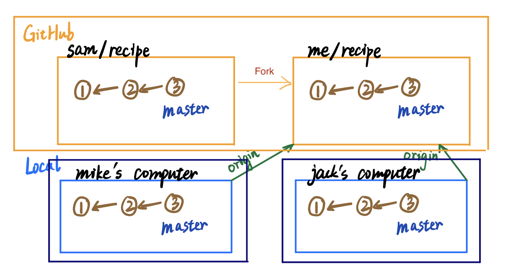


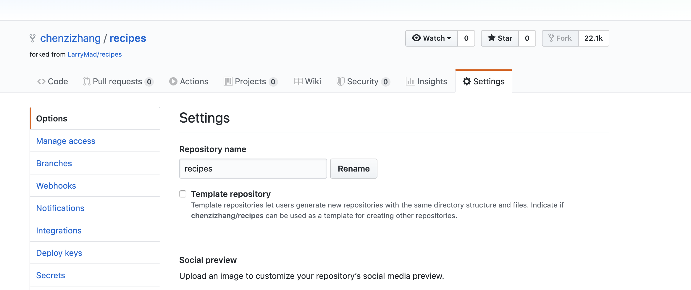
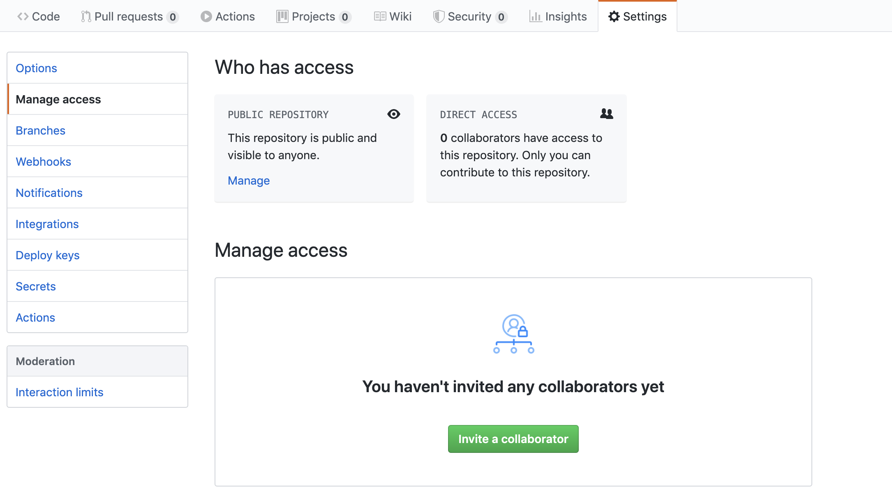

```Shell
chenzizhang Git-GitHub $ cd version-control
chenzizhang version-control $ git clone https://github.com/chenzizhang/recipes.git
Cloning into 'recipes'...
remote: Enumerating objects: 16, done.
remote: Total 16 (delta 0), reused 0 (delta 0), pack-reused 16
Unpacking objects: 100% (16/16), done.
chenzizhang version-control $ cd recipes
chenzizhang (master) recipes $  git remote -v
origin https://github.com/chenzizhang/recipes.git (fetch)
origin https://github.com/chenzizhang/recipes.git (push)
```

Where was my commit?  
* Add a new recipe on my computer and commit it on the master branch  
* Push the master branch to my fork  
* Before `push`: My change only existed locally. It will not automatically be shared to remotes  
* After `push`: My change existed locally and on **my** fork  

### Conflict  [[top](#Git-and-GitHub-Notes)]  

[](https://mermaid-js.github.io/mermaid-live-editor/#/edit/eyJjb2RlIjoiZ3JhcGggVERcblx0TG9jYWwgLS0-IEFbYWM1XVxuXHRBIC0tPiB8bWFzdGVyfCBFW2IzY11cblx0R2l0SHViIC0tPiBDW2FjNV1cblx0QyAtLT4gfG1hc3RlcnwgRFtkZjZdXG5cdFx0XHRcdFx0IiwibWVybWFpZCI6eyJ0aGVtZSI6ImRlZmF1bHQifSwidXBkYXRlRWRpdG9yIjpmYWxzZX0)

Oepn, revise and push

```Shell
chenzizhang (master) recipes $ open chili-recipe.txt
chenzizhang (master) recipes $ git add chili-recipe.txt
chenzizhang (master +) recipes $ git status
On branch master
Your branch is up to date with 'origin/master'.
Changes to be committed:
  (use "git restore --staged <file>..." to unstage)
modified:   chili-recipe.txt
chenzizhang (master +) recipes $ git commit
[master c67310f] Add Spice to Chili Recipe
 1 file changed, 2 insertions(+), 1 deletion(-)
chenzizhang (master) recipes $ git status
On branch master
Your branch is ahead of 'origin/master' by 1 commit.
  (use "git push" to publish your local commits)
nothing to commit, working tree clean
```


### Updating Local Copies of Remote Branches: `git fetch`,`git pull`[[top](#Git-and-GitHub-Notes)]

| Command | Local | GitHub | Notes |
|---|---|---|---|  
| `git remote add origin [URL]`| | [eb2 v1] master| create remote |
| `git clone`| [eb2 v1] origin/master master| [eb2 v1] master| clone to local |
| `git commit`| [eb2 v1] origin/master [f34 v1 v1] master | [eb2 v1] master| commit locally |
| `git push master`| [eb2 v1] [f34 v1 v1] origin/master master | [eb2 v1] [f34 v1 v1] master| push commit|
| | ...[f34 v1 v1] origin/master [a72 v2 v1] master | ... [f34 v1 v1][5b3 v2 v2] master|update both local and GitHub differently|
| `git fetch` | ...[f34 v1 v1] <---[5b3 v2 v2] origin/master // <---[a72 v2 v1] master| ... [f34 v1 v1][5b3 v2 v2] master| up-to-date origin and master in local are in two flows|

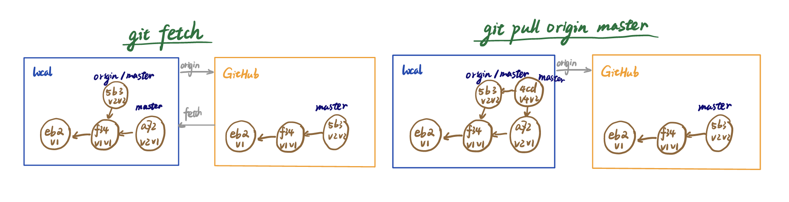

`git pull origin master` = `git fetch origin` + `git merge master origin/master`  

```Shell
chenzizhang (master) recipes $ git branch -a
* master
  remotes/origin/HEAD -> origin/master
  remotes/origin/master
chenzizhang (master) recipes $ git fetch origin
remote: Enumerating objects: 3, done.
remote: Counting objects: 100% (3/3), done.
remote: Total 3 (delta 2), reused 3 (delta 2), pack-reused 0
Unpacking objects: 100% (3/3), done.
From https://github.com/chenzizhang/recipes
   15bd0e1..78cab31  master     -> origin/master
chenzizhang (master) recipes $ git diff origin/master master
diff --git a/chili-recipe.txt b/chili-recipe.txt
index c42469e..cbb5244 100644
--- a/chili-recipe.txt
+++ b/chili-recipe.txt
@@ -3,16 +3,18 @@ Ingredients:
  - 2 cloves garlic, chopped
  - One 8-ounce can tomato sauce
  - 2 tablespoons chili powder
+ - 1 teaspoon ground cumin
  - 1 teaspoon ground oregano
  - 1 teaspoon salt
  - 1/4 teaspoon cayenne pepper
  - 1/4 cup corn flour
  - One 15-ounce can kidney beans, drained and rinsed
  - One 15-ounce can pinto beans, drained and rinsed
+ - 1 teaspoon spice
 Directions:
  1. Brown the ground beef in a large bot and drain off the excess fat.
- 2. Add the tomato sauce, chili powder, oregano, salt, and cayenne.
+ 2. Add the tomato sauce, chili powder, cumin, oregano, salt, spice, and cayenne.
  3. Stir, then cover and simmer over low heat for one hour.
  4. Mix the corn flour and 1/2 cup water in a small bowl.  Add to chili.
  5. Add the beans and simmer for 10 more minutes.
```

|  | `git log origin/master`| `git status` |
|---|---|---|
| Before `git fetch`| (1) Add chili recipe| Ahead|
| After `git fetch`|(1) Add chili recipe (2) Remove cumin|Out-of-sync|

After `git fetch`
```Shell
chenzizhang (master) recipes $ git log origin/master
commit 78cab31e223c38a452bf922b54b3e6d77da6da50 (origin/master, origin/HEAD)
Author: Sarah Spikes <sarah+github@udacity.com>
Date:   Mon May 11 22:48:40 2020 -0400
    Remove cumin from chili
commit 15bd0e1c52c6e11aaea594cf9a63d19c2baea0ad
Author: Larry Madrigal <larry@knowlabs.com>
Date:   Wed Nov 16 13:51:52 2016 -0800
    Update README.md
commit a6a2f991a1bb60e1dec7c5d68c8393b70ea6f7f6
Author: Larry Madrigal <larry@udacity.com>
Date:   Thu Sep 25 11:08:27 2014 -0700
    Add a chili recipe
commit b36125034401bc8c6d3984c032f400f157a32c48
Author: Larry Madrigal <larry@udacity.com>
Date:   Thu Sep 25 11:08:01 2014 -0700
    Add a cake and frosting recipe
chenzizhang (master) recipes $ git status
On branch master
Your branch and 'origin/master' have diverged,
and have 1 and 1 different commits each, respectively.
  (use "git pull" to merge the remote branch into yours)
Untracked files:
  (use "git add <file>..." to include in what will be committed)
sarah_changes.sh
nothing added to commit but untracked files present (use "git add" to track)
chenzizhang (master) recipes $ git log master
commit c67310f5de4e82a87909fc89588659a17dedfc71 (HEAD -> master)
Author: Chenzi Zhang <chenzi.zhang.96@gmail.com>
Date:   Mon May 11 22:26:02 2020 -0400
    Add Spice to Chili Recipe
commit 15bd0e1c52c6e11aaea594cf9a63d19c2baea0ad
Author: Larry Madrigal <larry@knowlabs.com>
Date:   Wed Nov 16 13:51:52 2016 -0800
    Update README.md
commit a6a2f991a1bb60e1dec7c5d68c8393b70ea6f7f6
Author: Larry Madrigal <larry@udacity.com>
Date:   Thu Sep 25 11:08:27 2014 -0700
    Add a chili recipe
commit b36125034401bc8c6d3984c032f400f157a32c48
Author: Larry Madrigal <larry@udacity.com>
Date:   Thu Sep 25 11:08:01 2014 -0700
    Add a cake and frosting recipe
```

#### Merging the Changes Together  

* Make a change and commit it in master branch locally  
* Fetch origin and merge origin/master to new master  

```Shell
chenzizhang (master) recipes $ git add chili-recipe.txt
chenzizhang (master) recipes $ git commit
On branch master
Your branch is ahead of 'origin/master' by 2 commits.
  (use "git push" to publish your local commits)
Untracked files:
sarah_changes.sh
nothing added to commit but untracked files present
chenzizhang (master) recipes $ git pull origin master
From https://github.com/chenzizhang/recipes
 * branch            master     -> FETCH_HEAD
Already up to date.
chenzizhang (master) recipes $ git push origin master
Enumerating objects: 10, done.
Counting objects: 100% (10/10), done.
Delta compression using up to 8 threads
Compressing objects: 100% (6/6), done.
Writing objects: 100% (6/6), 661 bytes | 661.00 KiB/s, done.
Total 6 (delta 4), reused 0 (delta 0)
remote: Resolving deltas: 100% (4/4), completed with 2 local objects.
To https://github.com/chenzizhang/recipes.git
   78cab31..f52f2aa  master -> master
chenzizhang (master) recipes $ git status
On branch master
Your branch is up to date with 'origin/master'.
Untracked files:
  (use "git add <file>..." to include in what will be committed)
sarah_changes.sh
nothing added to commit but untracked files present (use "git add" to track)
```

#### Fast-Forward Merges  

Update label instead of merging under following condition
* Branch labels A and B
* A is an ancestor of B. A is reachable by B.  
* Fast-forward merge  

Example  
[](https://mermaid-js.github.io/mermaid-live-editor/#/edit/eyJjb2RlIjoiZ3JhcGggVERcblx0QVthXSAtLT4gQltiXVxuXHRCIC0tPiB8QXwgQ1tjXVxuXHRCIC0tPiBEW2RdXG5cdEMgLS0-IEVbZV1cblx0RCAtLT4gRVtlXVxuXHRFIC0tPiB8QnwgRltmXSIsIm1lcm1haWQiOnsidGhlbWUiOiJkZWZhdWx0In0sInVwZGF0ZUVkaXRvciI6ZmFsc2V9)


### Pull Request  [[top](#Git-and-GitHub-Notes)]  
Q: Why we want to make a pull request?  
A: When we want to change the code on someone's GitHub  

#### Making a Pull Request  

* STEP 1: Fork the repository to my account
* STEP 2: Clone the repository in my account to local space  
* STEP 3: Change the code locally
* SPTE 4: Push the new version on new branch `different-oil` to my repository  
* STEP 5: Click on `Pull request` on the top right, return to my `different-oil` branch, and click on green bottom `Create pulll request` on GitHub  
* STEP 6: The author will choose whether to merge your version or not

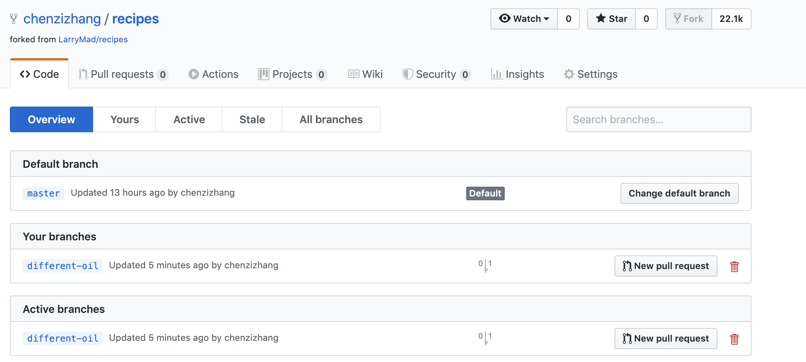  
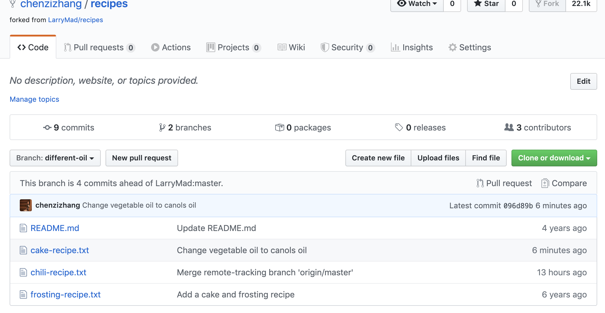  
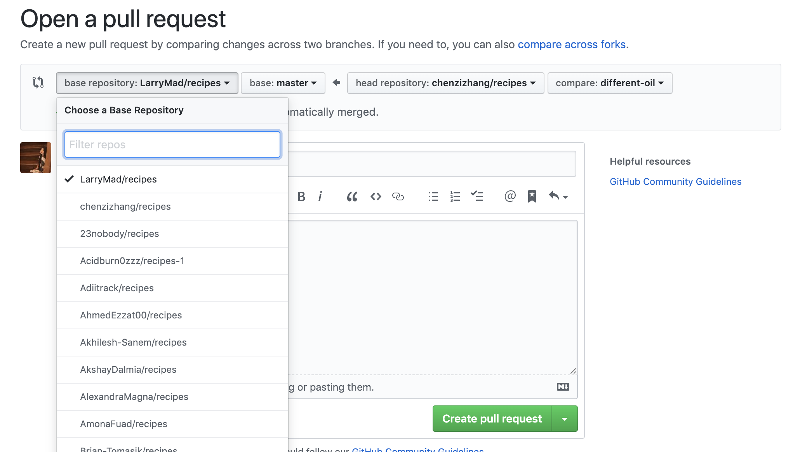  
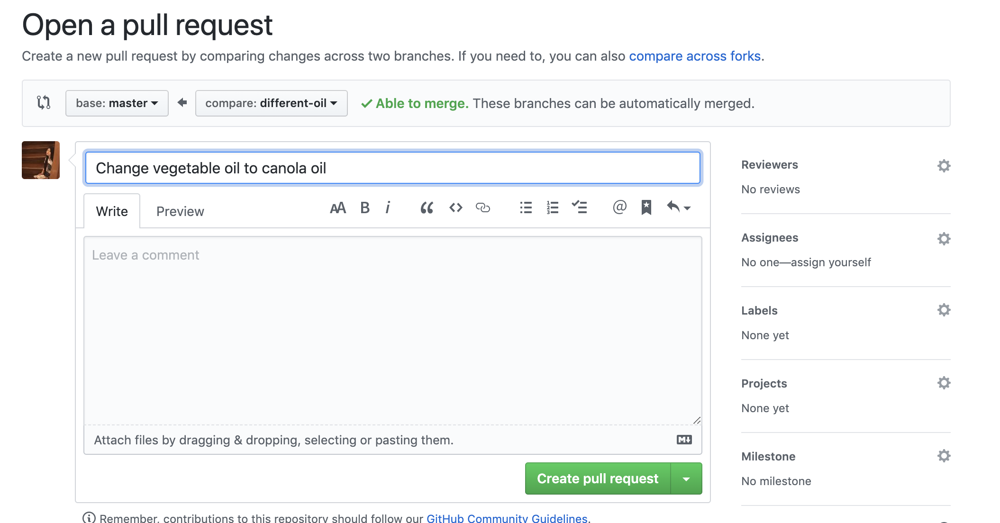  
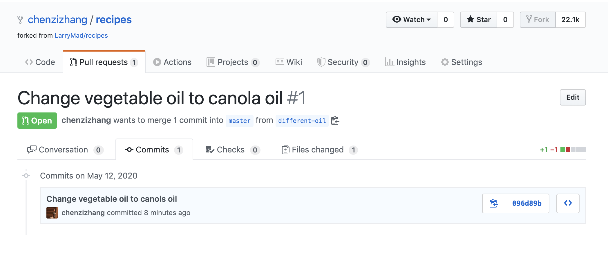  
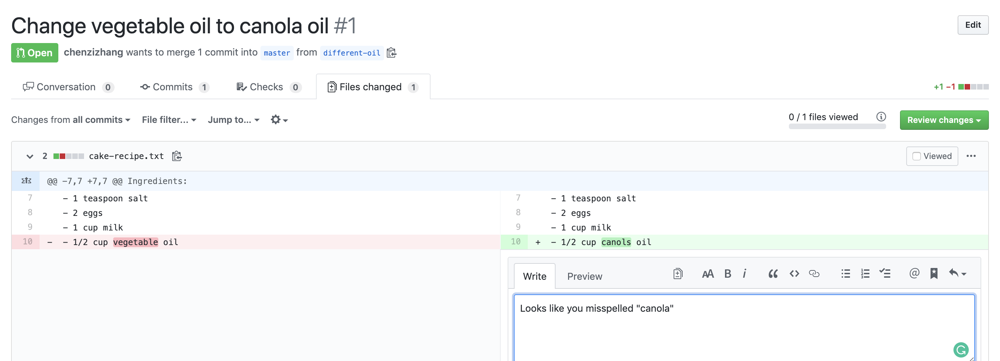  
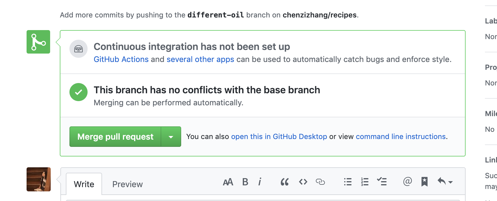  

|  | local working directory| local staging area | local master branch | GitHub master branch|
|---|---|---|---|---|
| edit and save `README.md`| X | | | |
| `git add README.md`|| X | | |
| `git commit`| | | X | |
| `git pull origin master`| | | X | |
| `git push origin master`| | | | X |
| merge git pull request | | | | X |


Also check out local working directory and local staging area for git pull origin master since the working directory and staging area will also update when you run `git pull`.  

#### Updating a Pull Request  

When you made a pull request and the forked repository response you pointing out your bugs by an email, you would like to commit your fix next.

```Shell
chenzizhang (different-oil *) recipes $ git add cake-recipe.txt
chenzizhang (different-oil +) recipes $ git commit
[different-oil ac12f4a] Fix canola typo
 1 file changed, 1 insertion(+), 1 deletion(-)
chenzizhang (different-oil) recipes $ git push origin different-oil
Enumerating objects: 5, done.
Counting objects: 100% (5/5), done.
Delta compression using up to 8 threads
Compressing objects: 100% (3/3), done.
Writing objects: 100% (3/3), 299 bytes | 299.00 KiB/s, done.
Total 3 (delta 2), reused 0 (delta 0)
remote: Resolving deltas: 100% (2/2), completed with 2 local objects.
To https://github.com/chenzizhang/recipes.git
   096d89b..ac12f4a  different-oil -> different-oil
```

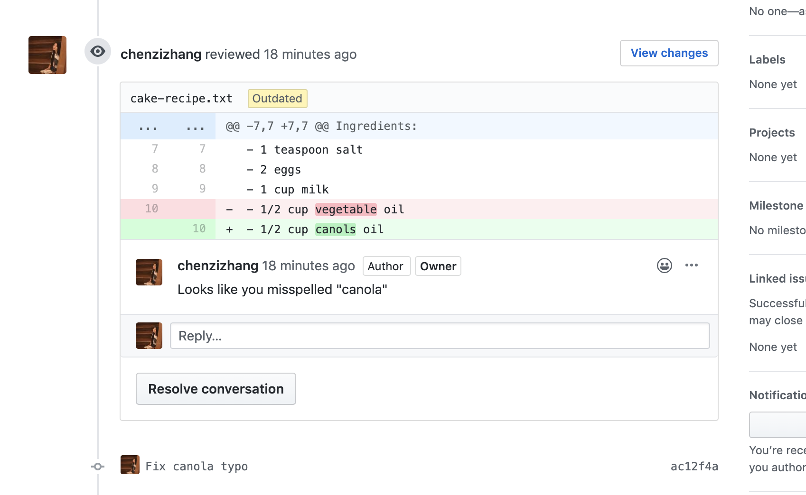


#### Conflicting Changes  

When two pull request are conflict on the same commit/branch, we would like to fix the conflicts.  

Braches:
 - `master`  
 - `more-oil`  
 - `different-oil`

Steps:
 - GitHub: merge pull request from `more-oil` branch -> new `master`
 - GitHub: delete `more-oil` branch
 - Local: pull origin master into local worksapce
 - Local: compare `different-oil` with `master`, clean conflict and commit to `different-oil` branch
 - Local: merge `different-oil` into `master`
 - Local: push new `different-oil` to GitHub  


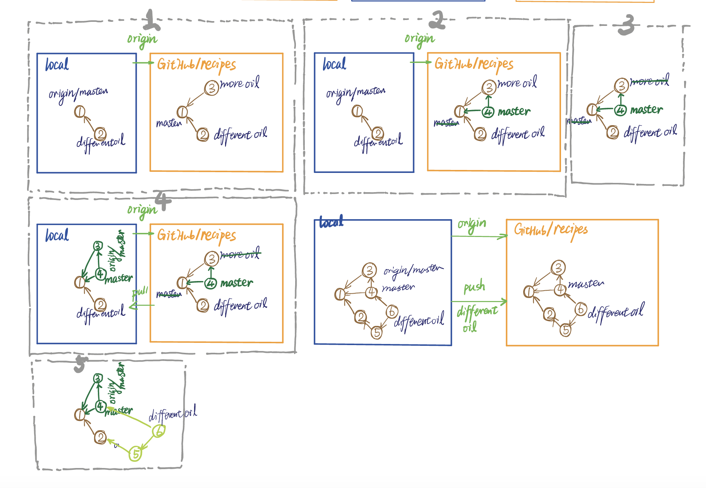


#### Updating Your Local Repository  
This is between STEP 4 and STEP 5 in the previous section. When merging the conflict branch into `master`, make sure you:  
 - Check out the `master` branch  
 - Use `git add` on the conflict files before committing  

```shell
bash sarah_changes_2.sh https://github.com/chenzizhang/recipes.git
chenzizhang (master) recipes $ git log
chenzizhang (master) recipes $ git pull origin master
From https://github.com/chenzizhang/recipes
 * branch            master     -> FETCH_HEAD
Updating f52f2aa..7519905
Fast-forward
 cake-recipe.txt | 2 +-
 1 file changed, 1 insertion(+), 1 deletion(-)
```

Since we already know what changes are (Otherwise, we use `git fetch` `git merge origin/master master`):

```shell
chenzizhang (master) recipes $ git pull origin master
From https://github.com/chenzizhang/recipes
 * branch            master     -> FETCH_HEAD
Updating f52f2aa..7519905
Fast-forward
 cake-recipe.txt | 2 +-
 1 file changed, 1 insertion(+), 1 deletion(-)
chenzizhang (master) recipes $ git checkout different-oil
Switched to branch 'different-oil'
chenzizhang (different-oil) recipes $ git merge master different-oil
chenzizhang (different-oil) recipes $ subl cake-recipe.txt
chenzizhang (different-oil) recipes $ git commit
On branch different-oil
Untracked files:
sarah_changes.sh
sarah_changes_2.sh
nothing added to commit but untracked files present
chenzizhang (different-oil) recipes $ git log
commit b3aec5c87362bc35bc8fa6835d4c4479a8ab9a39 (HEAD -> different-oil)
Merge: ac12f4a 7519905
Author: Chenzi Zhang <chenzi.zhang.96@gmail.com>
Date:   Tue May 12 22:58:43 2020 -0400
Merge branch 'master' of https://github.com/chenzizhang/recipes into different-oil
commit 75199050e491091ee7a6c446e0df7f6f4971bfc2 (origin/master, origin/HEAD, master)
Author: Sarah Spikes <sarah+github@udacity.com>
Date:   Tue May 12 22:51:51 2020 -0400
    Merge pull request from more-oil    
    Add more oil so the cake is more moist!
```

It contains both of the changes.

```Shell
chenzizhang (different-oil) recipes $ git push origin different-oil
Enumerating objects: 7, done.
Counting objects: 100% (7/7), done.
Delta compression using up to 8 threads
Compressing objects: 100% (3/3), done.
Writing objects: 100% (3/3), 372 bytes | 372.00 KiB/s, done.
Total 3 (delta 2), reused 0 (delta 0)
remote: Resolving deltas: 100% (2/2), completed with 2 local objects.
To https://github.com/chenzizhang/recipes.git
   ac12f4a..b3aec5c  different-oil -> different-oil
```

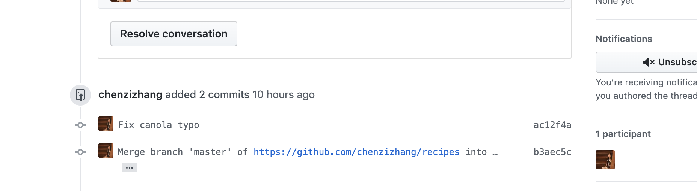
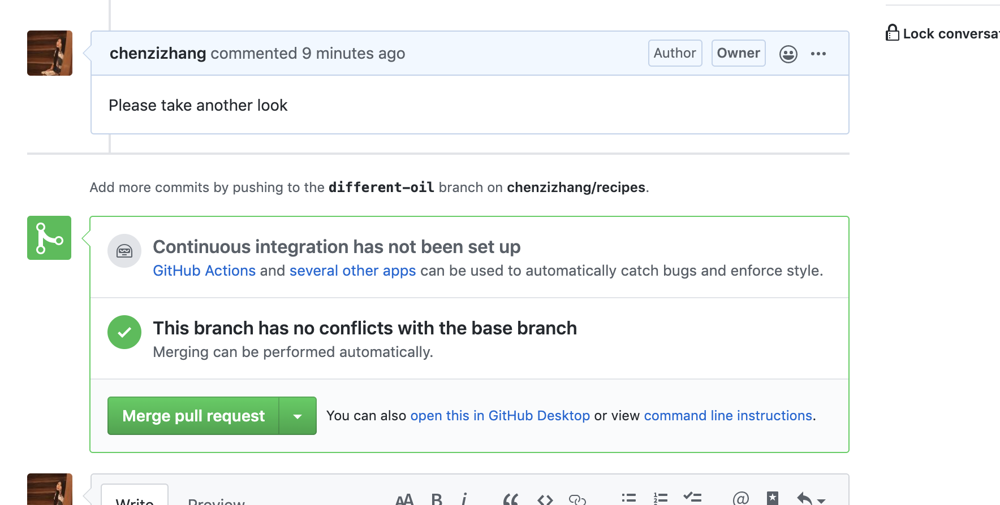
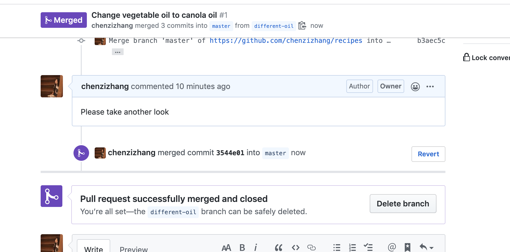
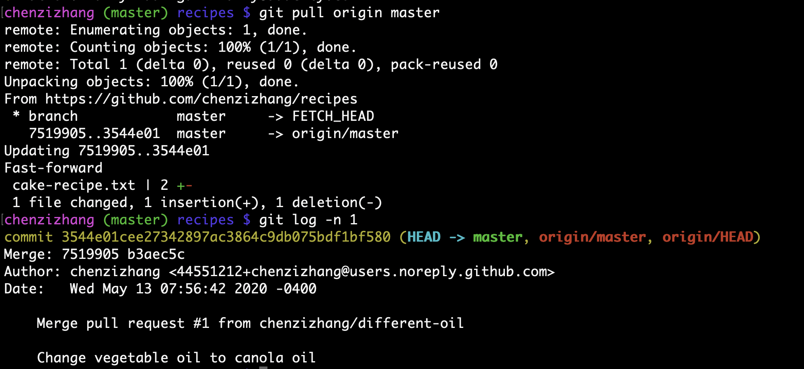

Notice that the commit message:
- Indicates that a pull request was merged
- Gives the number of the pull request (#1 here)
- Gives the branch the pull request was merged from (cbuckey-uda/different-oil here).
- Contains the title of the pull request.

GitHub automatically creates a commit message like this whenever a pull request is merged to make it easy to see pull requests in the commit history. Even when the merge is a fast-forward merge, GitHub still creates this commit.


### Fork  [[top](#Git-and-GitHub-Notes)]
#### Modifying the Adventure Repository  
The [repository](https://github.com/udacity/create-your-own-adventure).

Steps
- Fork the repository and clone the fork  
- Create a branch to make your own changes
- Make a pull request
- Ask for your pull request to be merged
- If needed, update your pull request

#### Keeping a Fork Up-to-Date
Set up an upstream remote on original repository

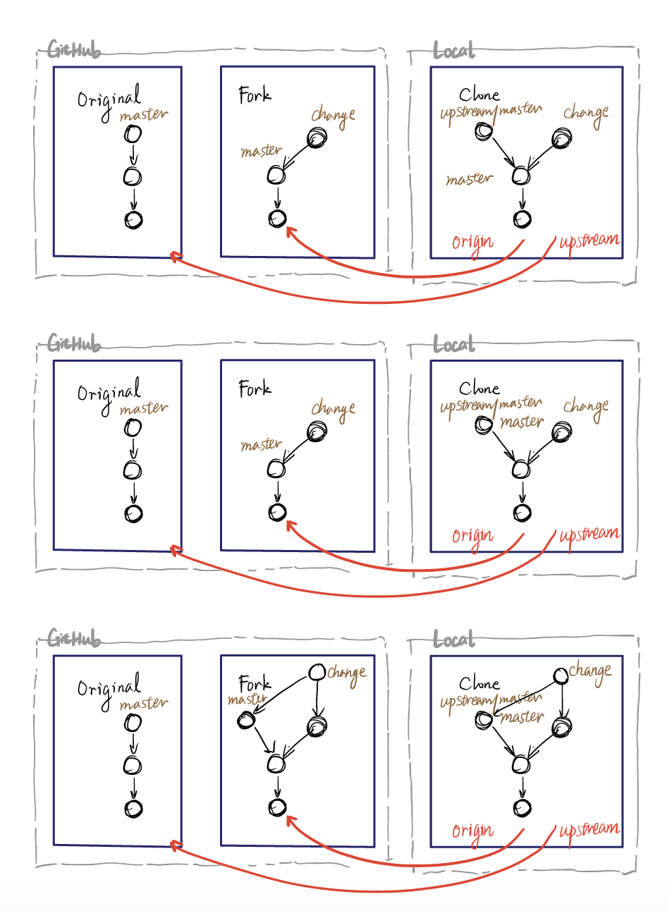

Steps:
- `git remote upstream https://github.com/udacity/create-your-own-adventure.git`
- `git checkout master`  
- `git pull upstream master`  
- `git log`  
- `git checkout stop-drop-roll`  
- `git merge master stop-drop-roll`
- Meet conflicts  
- Make changes in conflict files  
- `git add fire.md`
- `git commit`
- `git push origin stop-drop-roll`
- `git checkout master`
- `git push`

This pull request can be automatically merged.

# Reference  
Markdown
* Diagram Editor: [Mermaid Live Editor](https://mermaid-js.github.io/mermaid-live-editor/#/edit/eyJjb2RlIjoiZ3JhcGggVERcbiAgQVtDaHJpc3RtYXNdIC0tPnxHZXQgbW9uZXl8IEIoR28gc2hvcHBpbmcpXG4gIEIgLS0-IEN7TGV0IG1lIHRoaW5rfVxuICBDIC0tPnxPbmV8IERbTGFwdG9wXVxuICBDIC0tPnxUd298IEVbaVBob25lXVxuICBDIC0tPnxUaHJlZXwgRltmYTpmYS1jYXIgQ2FyXVxuXHRcdCIsIm1lcm1haWQiOnsidGhlbWUiOiJkZWZhdWx0In19)

* Table of contents: <a href='http://ecotrust-canada.github.io/markdown-toc/'>Generated with markdown-toc
